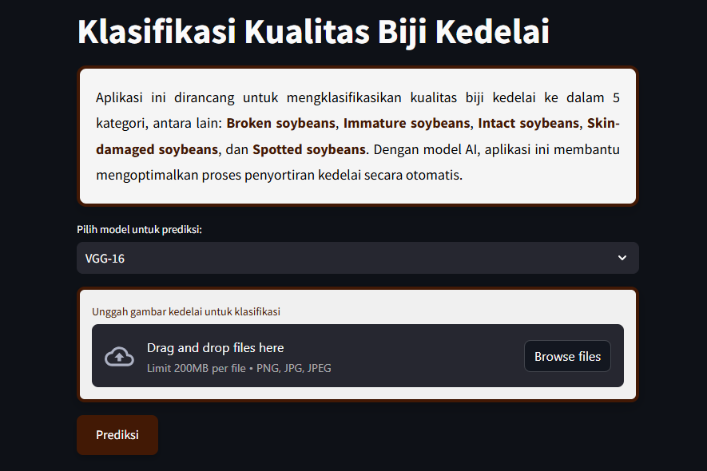
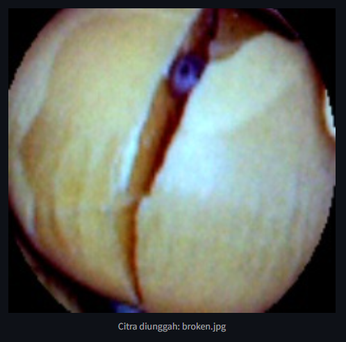

# **KLASIFIKASI KUALITAS BIJI KEDELAI MENGGUNAKAN VGG-16 DAN RESNET-50**

## 📖 **OVERVIEW PROJECT**
Tujuan dari proyek ini adalah untuk mengembangkan sistem yang dapat mempermudah dan mempercepat identifikasi jenis kualitas benih kedelai untuk meningkatkan efisiensi dan kualitas pemrosesan benih kedelai secara keseluruhan. Klasifikasi secara manual sering kali menghadapi tantangan dalam menyortir benih kedelai secara akurat dan cepat, terutama di berbagai kategori seperti kedelai utuh, berbintik, belum matang, rusak, dan rusak kulit. Tantangan-tantangan ini dapat mengurangi efisiensi dan kualitas yang tidak konsisten jika dilakukan secara manual. Untuk mengatasi hal ini, teknologi pemrosesan gambar dan pembelajaran mendalam memberikan solusi dengan memungkinkan klasifikasi dan penyortiran biji kedelai secara otomatis. Teknologi ini tidak hanya meningkatkan efisiensi pemrosesan, tetapi juga memastikan standar kualitas produk dan mendukung skalabilitas dalam praktik pertanian.

## 📂 **DATASET**
Dalam projek ini, data yang digunakan dari platform Mendeley Data ([Soybean Seeds Dataset](https://data.mendeley.com/datasets/v6vzvfszj6/6)). Dataset ini terdiri dari lima jenis biji kedelai, yaitu utuh, berbintik, belum matang, pecah, dan rusak kulitnya, dengan masing-masing kategori memiliki lebih dari 1000 citra biji kedelai. Total keseluruhan dataset pada penelitian ini berjumlah 5513 citra. Semua citra berukuran sama, yakni 277 x 277 pixel.


## ⚙ **PREPROCESSING**
Tahap preprocessing dilakukan untuk memperbaiki kualitas data serta mencegah hasil yang kurang optimal untuk meningkatkan kualitas dataset agar sesuai dengan model yang akan digunakan.

Berikut tahapan preprocessing yang dilakukan:
1. **Reshape**: dengan mengubah dimensi gambar menjadi ukuran yang diharapkan oleh model (224 x 224 piksel).
2. **Rescale**: dengan mengubah rentang nilai piksel dari 0 hingga 255 menjadi nilai 0 hingga 1.
3. Splitting Data
   - **Train**: 80% data digunakan untuk proses pelatihan model.
   - **Validation**: 10% data digunakan untuk memantau performa model selama pelatihan berlangsung.
   - **Test**: 10% digunakan untuk menguji kinerja model setelah proses pelatihan selesai.

## 🧠 **MODELS**
### **1. VGG-16**


VGG-16 merupakan arsitektur jaringan syaraf konvolusional (CNN). VGG16 memiliki 16 lapisan yang terdiri dari lapisan konvolusi dan lapisan fully connected. VGG16 menggunakan filter berukuran kecil (3x3) dan max pooling untuk mengurangi dimensi data secara bertahap.

**Architecture adjustments**: 
- Global Average Pooling setelah convolutional layers.
- Dense layers: 512 → 128 → 5 dengan aktivasi ReLU, diikuti oleh softmax layer.
- Dropout layers 0,5 untuk regularisasi.
- Early Stopping patience of 5 epochs.

**Hasil Pelatihan**:
- Akurasi pelatihan: **82.44%** (epoch-15)
- Akurasi validasi: **83.08%**
- Hasil Model: [Model VGG-16](https://drive.google.com/file/d/1SfpihQXAZtq8YJuF5p7RSpqGDWIHIJAS/view?usp=sharing)

### **2. ResNet50**


ResNet50 adalah arsitektur CNN yang diperkenalkan oleh Microsoft Research dan merupakan bagian dari keluarga Residual Networks. ResNet50 memiliki 50 lapisan dan menggunakan arsitektur residual yang mengimplementasikan shortcut connections.

**Architecture adjustments:**:
- Global Average Pooling setelah convolutional layers.
- Dense layers: 512 → 128 → 5 dengan aktivasi ReLU, diikuti oleh softmax layer.
- Dropout layers 0,5 untuk regularisasi.
- Early Stopping patience of 5 epochs.

**Hasil Pelatihan**:
- Akurasi pelatihan: **89.28%** (epoch-24)
- Akurasi validasi: **86.93%**
- Hasil Model: [Model ResNet50](https://drive.google.com/file/d/1nheRUCtvYBtWhM5SEousA97VVv1j1zmP/view?usp=sharing)

## 📊 **EVALUASI MODEL**
### **VGG-16**
#### **Hasil Grafik Pelatihan**

#### **Hasil Classification Report**

#### **Hasil Confussion Matrix**


### **ResNet50**
#### **Hasil Grafik Pelatihan**

#### **Hasil Classification Report**

#### **Hasil Confussion Matrix**


## 🌐 **STREAMLIT**
_framework_ Python yang digunakan untuk dengan cepat membangun dan berbagi aplikasi web yang menarik.
### **Web UI**

### **Result UI**


## 📃 **DEPENDENSI & LANGKAH INSTALASI**

### **Dependensi yang Dibutuhkan**
- `tensorflow>=2.18.0`
- `scikit-learn>=1.6.0`
- `streamlit>=1.41.1`
- `numpy>=1.23.0`
- `matplotlib>=3.8.0`

### **Langkah Instalasi TensorFlow Menggunakan PDM**
1. **Upgrade Pip ke Versi Terbaru**
    ```bash
    pip install --upgrade pip
    ```
2. **Menginstal Rilis Stabil TensorFlow untuk CPU dan GPU**
    ```bash
    pip install tensorflow
    ```
3. **Menginstal Versi Pratinjau TensorFlow (Opsional)**
    ```bash
    pip install tf-nightly
    ```
**Catatan:**
Sebelum menginstal TensorFlow, pastikan Python sudah terinstal di sistem, dan gunakan lingkungan virtual (virtual environment) untuk mengelola dependensi proyek dengan lebih baik.

### **Struktur File Proyek**
- `app.py`: File utama yang berisi rute dan fungsi inti.
- `klasifikasi_citra.py`: File implementasi model untuk melakukan klasifikasi gambar sekaligus mengelola tampilan antarmuka web.

### **Menjalankan Aplikasi**
- Jalankan aplikasi dengan perintah berikut:
    ```bash
    streamlit run ./src/app.py
    ```
- Akses aplikasi melalui peramban web di alamat:
  [Local URL](http://localhost:8501)
  [Network URL](http://192.168.1.31:8501)

## **AUTHOR**
[Valencia Sefiana Putri]


